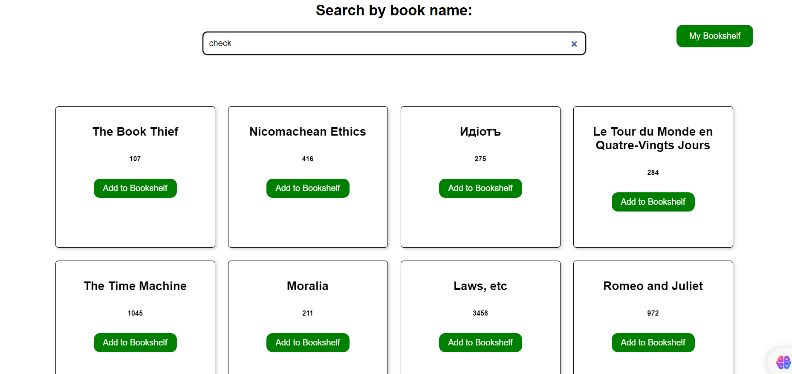
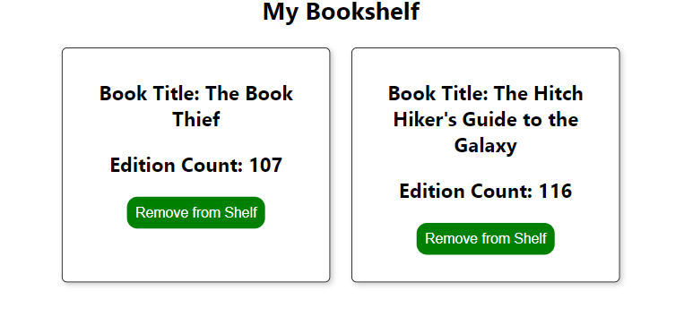

<h1 align="center"> myBookShelf </h1>

## Live Link:

    https://shhiivvaam-bookshelf.netlify.app/

### OBJECTIVE :

    React application allowing users to search for books using the Open Library API and maintain a personal bookshelf in the browser using localStorage.

### FEATURES LIST :

    1. Book Search: Input field for users to type in a book's name and display search results in real-time as the user types.
    2. Add to Bookshelf: Enable users to add books from the search results to a "My Bookshelf" page.
    3. Personal Bookshelf: Display the user's personal bookshelf, which is stored persistently using localStorage.
    4. Responsive Design: Enjoy a seamless experience whether you're browsing on a desktop, tablet, or mobile device.



### Technologies Used

    Framework: React
    API: Open Library API
    State Management: React useState and useEffect
    Routing: React Router
    Storage: LocalStorage
    Deployment: Netlify

# Run Scripts

```Terminal
git clone https://github.com/shhiivvaam/personal-bookshelf.git

cd personal-bookshelf
npm install
npm start
```

Thank you for visiting!
